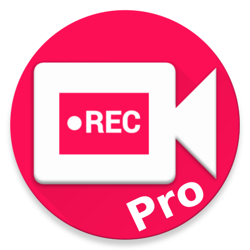

# Screen Recorder Pro

<div align="center">



[](https://github.com/devlopersabbir/screen-recoder-pro/actions/workflows/ci.yml)
[](https://github.com/devlopersabbir/screen-recoder-pro/actions/workflows/release.yml)
[](LICENSE)
[](CHANGELOG.md)
[](https://www.typescriptlang.org/)
[](https://bun.sh)
[](#-privacy--security-first)

**A lightweight, production-grade, local-first browser extension for seamless screen recording in Chrome and Firefox.**

[Features](#-features-at-a-glance) •
[How It Works](#-how-it-works) •
[Quick Start](#-quick-start) •
[Browser Compatibility](#-browser-compatibility) •
[Available Scripts](#-available-scripts) •
[Privacy & Security](#-privacy--security-first) •
[Contributing](#-contributing)

</div>

---

## 🌟 Features at a Glance

Screen Recorder Pro is built from the ground up to provide a smooth, fast, and entirely private screen recording experience without third-party cloud dependencies or costly subscriptions.

- 🖥️ **Flexible Screen Capture**: Record your entire desktop, a single application window, or an individual browser tab with one click.
- 🔒 **100% Local & Private**: All video capture and encoding happens in-memory on your machine. Zero cloud uploads, zero tracking, and zero telemetry.
- ⏹️ **Native Stop-Sharing Detection**: Immediately synchronizes when you click the browser's floating "Stop sharing" bar, cleanly finalizing your video without hanging or corruption.
- 🎬 **Smart WebM Encoding**: Automatically selects the highest-fidelity video codec supported by your system (`vp9`, `vp8`, `opus`).
- 💾 **Instant Local Download**: Generates cleanly timestamped video files (`screen-recording-YYYY-MM-DD-HH-mm.webm`) and triggers direct browser downloads.
- 🚫 **No Watermarks & No Time Limits**: Record freely without arbitrary recording duration limits, banner overlays, or forced brand stamps.
- ⚡ **Zero Idle Footprint**: Built with modern web standards and minimal dependencies. Stays idle and consumes 0% CPU when not recording.
- 🪵 **Enterprise Diagnostic Logging**: Scoped in-memory logging with instant one-click report export to simplify troubleshooting.

---

## 🎬 How It Works

Screen Recorder Pro makes recording your screen as simple as four steps:

```text
┌──────────────────┐     ┌──────────────────┐     ┌──────────────────┐     ┌──────────────────┐
│  1. Open Popup   │ ──> │ 2. Select Source │ ──> │ 3. Record Screen │ ──> │ 4. Save to Disk  │
│  Click extension │     │ Choose Screen,   │     │ Capture video    │     │ Instant local    │
│  toolbar icon    │     │ Window, or Tab   │     │ in real time     │     │ WebM download    │
└──────────────────┘     └──────────────────┘     └──────────────────┘     └──────────────────┘
```

1. **Open the Extension**: Click the Screen Recorder Pro icon in your browser toolbar.
2. **Select Your Source**: Click **Start Recording** and choose whether to capture your entire desktop screen, a specific app window, or a browser tab.
3. **Capture Cleanly**: An active recording indicator keeps you informed of the session status.
4. **Download Instantly**: Click **Stop Recording** (or the browser's native stop bar), then click **Download Recording** to save the `.webm` file directly to your Downloads folder.

---

## 🚀 Quick Start

### Installation

#### Option 1: Load Pre-Packaged Release
1. Download the latest `v*_chrome.zip` or `v*_firefox.zip` from [Releases](https://github.com/devlopersabbir/screen-recoder-pro/releases).
2. Unpack the zip archive to a local folder.
3. Follow the browser loading instructions below.

#### Option 2: Build from Source
```bash
# 1. Clone the repository
git clone https://github.com/devlopersabbir/screen-recoder-pro.git
cd screen-recoder-pro

# 2. Install dependencies (Bun recommended, or npm)
bun install

# 3. Start development server with live reload
bun dev
```

### Loading the Extension into Your Browser

#### Google Chrome / Brave / Microsoft Edge / Arc
1. Open `chrome://extensions/` (or `edge://extensions/` / `brave://extensions/`).
2. Toggle on **Developer mode** in the top right corner.
3. Click **Load unpacked** and select the `dist/` directory.

#### Mozilla Firefox
1. Open `about:debugging#/runtime/this-firefox`.
2. Click **Load Temporary Add-on...**.
3. Select `dist/manifest.json`.

---

## 🌐 Browser Compatibility

Screen Recorder Pro is built to adhere to WebExtensions standards and runs across modern desktop browsers:

| Browser | Supported | Minimum Version | Note |
| :--- | :---: | :---: | :--- |
| **Google Chrome** | ✅ | 116+ | Manifest V3 Service Worker |
| **Mozilla Firefox** | ✅ | 142+ | Manifest V3 Background Scripts & Gecko ID |
| **Microsoft Edge** | ✅ | 116+ | Chromium MV3 compatible |
| **Brave Browser** | ✅ | 116+ | Chromium MV3 compatible |
| **Opera** | ✅ | 102+ | Chromium MV3 compatible |
| **Arc Browser** | ✅ | Latest | Chromium MV3 compatible |

---

## 🛠️ Available Scripts

All project tasks can be run using either [Bun](https://bun.sh) or `npm`:

| Command | Description |
| :--- | :--- |
| `bun dev` | Starts Vite dev server and auto-launches **Brave Browser** with extension loaded |
| `bun run dev:brave` | Starts Vite dev server explicitly targeting **Brave Browser** |
| `bun run dev:firefox` | Starts Vite dev server explicitly targeting **Mozilla Firefox** |
| `bun run dev:chrome` | Starts Vite dev server explicitly targeting **Google Chrome** |
| `bun test` | Runs the full unit and integration test suite with coverage validation |
| `bun run build:chrome` | Compiles production bundle for Google Chrome (Manifest V3) |
| `bun run build:firefox` | Compiles production bundle for Mozilla Firefox (Manifest V3) |
| `bun run zip:all` | Compiles and packages both `v*_chrome.zip` and `v*_firefox.zip` |
| `bun run zip:chrome` | Compiles and packages Chrome extension zip bundle |
| `bun run zip:firefox` | Compiles and packages Firefox add-on zip bundle |
| `bun run lint:firefox` | Validates Firefox bundle with Mozilla's `web-ext lint` |
| `bun run deploy:chrome` | Compiles, packages, and uploads draft to Chrome Web Store API |
| `bun run deploy:firefox` | Compiles, validates, and submits signed add-on to Mozilla AMO |

---

## 🛡️ Privacy & Security First

Privacy is not an afterthought — it is the fundamental core of Screen Recorder Pro:

- 🔒 **Zero Data Collection**: No user metrics, search history, page contents, or recordings are ever collected or sent to remote servers.
- 📴 **100% Offline**: Operates fully offline without requiring an active internet connection.
- 🚫 **No Analytics or Trackers**: Absolutely zero third-party telemetry, tracking pixels, or marketing SDKs.
- 🔍 **Auditable & Open**: 100% of the codebase is public and open-source for community audit.

For complete details, please read our [Privacy Policy](PRIVACY.md) and [Security Policy](SECURITY.md).

---

## ❓ Frequently Asked Questions

<details>
<summary><b>Is Screen Recorder Pro free?</b></summary>
<br>
Yes. Screen Recorder Pro is completely free and open-source under the MIT license. There are no paid tiers, feature gating, or subscriptions.
</details>

<details>
<summary><b>Does it add watermarks or brand overlays to recordings?</b></summary>
<br>
No. Your recordings are 100% clean with zero added logos, watermarks, or branding.
</details>

<details>
<summary><b>Where are my videos saved?</b></summary>
<br>
Videos are downloaded directly to your computer's local Downloads folder using your browser's native download manager.
</details>

<details>
<summary><b>What formats are supported?</b></summary>
<br>
Recordings are saved as high-efficiency <code>.webm</code> files utilizing standard VP9 or VP8 video compression and Opus audio. These files play natively in modern browsers, VLC, and video editing suites.
</details>

---

## 🤝 Contributing

We welcome community contributions, bug reports, and feature suggestions!

- Please review our [Contributing Guidelines](CONTRIBUTING.md) to get started.
- All participants are expected to adhere to our [Code of Conduct](CODE_OF_CONDUCT.md).
- To view recent changes and release notes, check the [Changelog](CHANGELOG.md).

---

## 📄 License

This project is licensed under the [MIT License](LICENSE).  
Copyright &copy; 2026 **Sabbir Hossain Shuvo**.
